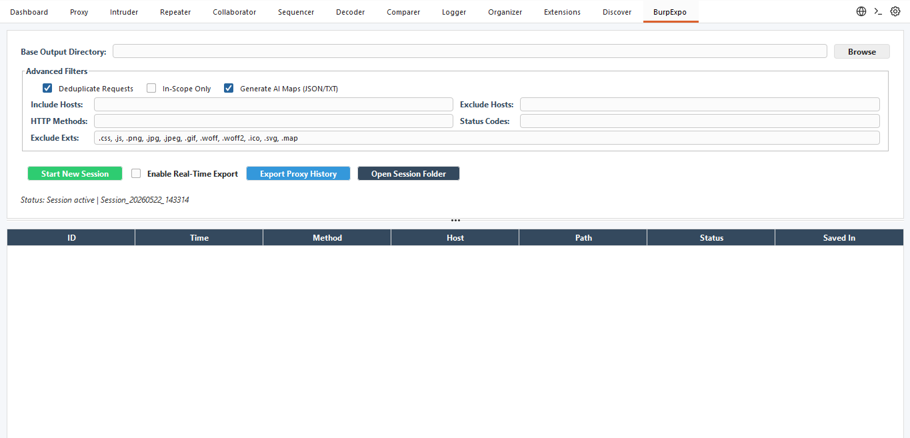
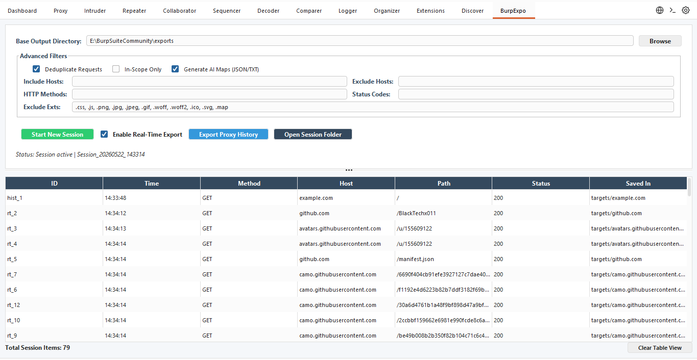
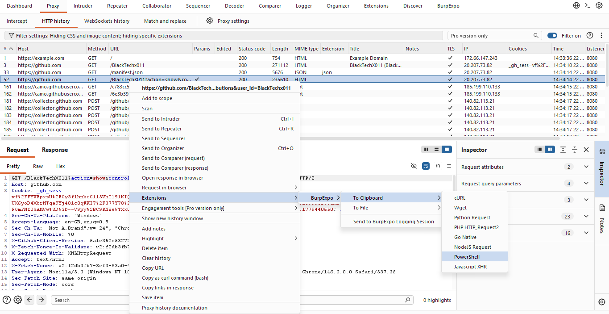

# BurpExpo 🚀

<div align="center">

```text
_______  __   __  ______    _______  _______  __   __  _______  _______ 
|  _    ||  | |  ||    _ |  |       ||       ||  |_|  ||       ||       |
| |_|   ||  | |  ||   | ||  |    _  ||    ___||       ||    _  ||   _   |
|       ||  |_|  ||   |_||_ |   |_| ||   |___ |       ||   |_| ||  | |  |
|  _   | |       ||    __  ||    ___||    ___| |     | |    ___||  |_|  |
| |_|   ||       ||   |  | ||   |    |   |___ |   _   ||   |    |       |
|_______||_______||___|  |_||___|    |_______||__| |__||___|    |_______|
```

**An advanced Burp Suite extension to export proxy traffic, generate AI/LLM context maps, and instantly convert HTTP requests into multi-language code snippets.**

[](https://github.com/BlackTechX011/BurpExpo/actions)
[](https://www.oracle.com/java/)
[](https://portswigger.net/burp)
[](https://github.com/BlackTechX011)

</div>

## 📖 Overview

**BurpExpo** is a powerful productivity extension for Bug Bounty Hunters, Penetration Testers, and Security Researchers. It bridges the gap between manual testing in Burp Suite and external toolchains (like custom scripts, LLMs, or reporting tools) by allowing you to easily filter, log, and export web traffic in real-time.

Whether you need to export an entire proxy history to feed into an AI/LLM for analysis, or just right-click a single request to copy it as a Python script, BurpExpo handles it seamlessly.

## ✨ Key Features

*   **Real-Time & Historical Exporting**: Export HTTP traffic live as you browse, or dump your entire existing Proxy History with a single click.
*   **AI / LLM Map Generation**: Automatically generates clean `map.json` and `map.txt` files mapping out endpoints, status codes, and file paths. Perfect for providing context to local LLMs or AI coding assistants.
*   **Multi-Language Snippet Generator**: Right-click *any* request in Burp Suite (or within the BurpExpo UI) to instantly copy it as:
    *   `cURL`
    *   `Python Request`
    *   `Wget`
    *   `Go Native`
    *   `NodeJS Request`
    *   `PowerShell`
    *   `PHP HTTP_Request2`
    *   `Javascript XHR`
*   **Advanced Traffic Filtering**:
    *   **In-Scope Only**: Ignore noise outside your target scope.
    *   **Deduplication**: Smart MD5 hashing ensures you don't save the exact same request twice.
    *   **Include/Exclude Hosts**: Target specific domains or ignore noisy analytics/tracking URLs.
    *   **HTTP Methods & Status Codes**: Filter by specific methods (`GET`, `POST`) or status codes (e.g., `200`, `4xx`, `5xx`).
    *   **Extension Filtering**: Automatically drop static assets (`.css`, `.js`, `.png`, etc.).
*   **Organized File Structure**: Automatically creates hierarchical directories based on the target host (`Session_Date/targets/example.com/data/`).

---

## 📸 Screenshots







---

## 📥 Installation

### Option 1: Download the Pre-compiled Release (Recommended)
1. Navigate to the [Releases page](../../releases).
2. Download the latest `BurpExpo-vX.X.X.jar` file.
3. Open Burp Suite -> **Extensions** -> **Installed** -> Click **Add**.
4. Select **Java** as the extension type.
5. Select the downloaded `.jar` file and click **Next**.

### Option 2: Build from Source
Ensure you have `git` and `Java 17+` installed.

```bash
# Clone the repository
git clone https://github.com/BlackTechX011/BurpExpo.git
cd BurpExpo

# Build the JAR file using Gradle
# On Linux/macOS:
./gradlew jar

# On Windows:
.\gradlew.bat jar
```
The compiled extension will be located at `build/libs/burpexpo.jar`.

---

## 🛠️ Usage Guide

### 1. Starting a Logging Session
1. Go to the **BurpExpo** tab in Burp Suite.
2. Click **Browse** to set a Base Output Directory.
3. Adjust your **Advanced Filters** (Exclude hosts, set status codes, etc.).
4. Click **Start New Session**.
5. Enable **Real-Time Export** to log traffic as you browse, OR click **Export Proxy History** to dump past traffic.

### 2. Exporting Code Snippets
You don't even need to use the BurpExpo tab to use the snippet generator!
1. Go to your **Proxy History**, **Repeater**, or **Target Site Map**.
2. **Right-click** any HTTP request.
3. Hover over **BurpExpo** in the context menu.
4. Select **To Clipboard** or **To File** and pick your desired programming language.

### 3. Using AI Context Maps
If you enabled `Generate AI Maps`, open your session folder and look for `map.json` or `map.txt`. 
You can pass this file directly into ChatGPT, Claude, or a local LLM to ask questions like: 
> *"Here is a map of the endpoints I discovered. Which ones look vulnerable to IDOR based on the parameter naming conventions?"*

---

## 🤝 Contributing

Contributions, issues, and feature requests are welcome!
1. Fork the Project
2. Create your Feature Branch (`git checkout -b feature/AmazingFeature`)
3. Commit your Changes (`git commit -m 'Add some AmazingFeature'`)
4. Push to the Branch (`git push origin feature/AmazingFeature`)
5. Open a Pull Request

---

## 📜 License & Disclaimer

**Author:** [@BlackTechX011](https://github.com/BlackTechX011)

This project is licensed under the MIT License - see the LICENSE file for details.

